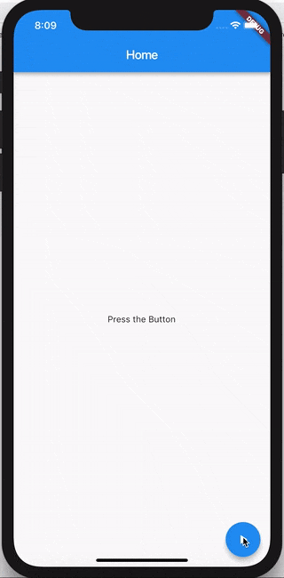

<!-- # show_snack_bar

A new Flutter project.

## Getting Started

This project is a starting point for a Flutter application.

A few resources to get you started if this is your first Flutter project:

- [Lab: Write your first Flutter app](https://docs.flutter.dev/get-started/codelab)
- [Cookbook: Useful Flutter samples](https://docs.flutter.dev/cookbook)

For help getting started with Flutter development, view the
[online documentation](https://docs.flutter.dev/), which offers tutorials,
samples, guidance on mobile development, and a full API reference. -->

# Receitas: Mostrar SnackBar com BlocListener

Nesta receita, vamos dar uma olhada em como usar **BlocListener** para mostrar um **SnackBar** em resposta a uma mudança de estado em um bloco.



> ## Bloc

Vamos construir um básico **DataBloc** que vai lidar **DataEvents** e saída **DataStates**.

### :pushpin: DataEvent

Por simplicidade, nosso **DataBloc** responderá apenas a um **DataEvent** chamado **FetchData**.

[data_event.dart](lib/data_event.dart).

### :pushpin: DataState

Nosso **DataBloc** pode ter um de três diferentes **DataStates**:

- **Initial** - o estado inicial antes de quaisquer eventos serem adicionados.
- **Loading** - o estado do bloco enquanto ele está "buscando dados" de forma assíncrona.
- **Success** - o estado do bloco quando ele "buscou dados" com sucesso. 

[data_state.dart](lib/data_state.dart).

### :pushpin: DataBloc

Nosso **DataBloc** deve ser algo assim:

```dart
import 'package:bloc/bloc.dart';

class DataBloc extends Bloc<DataEvent, DataState> {
  DataBloc() : super(Initial()) {
    on<FetchData>((event, emit) async {
      emit(Loading());
      await Future.delayed(Duration(seconds: 2));
      emit(Success());
    });
  }
```

> Observação: estamos usando **Future.delayed** para simular a latência.

[data_bloc.dart](lib/data_bloc.dart).

> ## Camada de IU

Agora vamos dar uma olhada em como conectar nosso **DataBloc** para um widget e mostrar um **SnackBar** em resposta a um estado de sucesso.

> Nós usamos o **BlocListener** widget para FAZER COISAS em resposta a mudanças de estado em nosso **DataBloc**.

> Nós usamos o **BlocBuilder** widget para RENDERIZAR WIDGETS em resposta a mudanças de estado em nosso **DataBloc**.

> :warning: Devemos NUNCA "fazer coisas" em resposta a mudanças de estado no **builder** método de **BlocBuilder** porque esse método pode ser chamado muitas vezes pelo framework Flutter. o **builder** deve ser uma [função pura](https://en.wikipedia.org/wiki/Pure_function) que apenas retorna um widget em resposta ao estado do bloco.

[main.dart](lib/main.dart).

A fonte completa desta receita pode ser encontrada [aqui](https://gist.github.com/felangel/1e5b2c25b263ad1aa7bbed75d8c76c44).

Dependência:
    flutter_bloc: ^8.1.1
