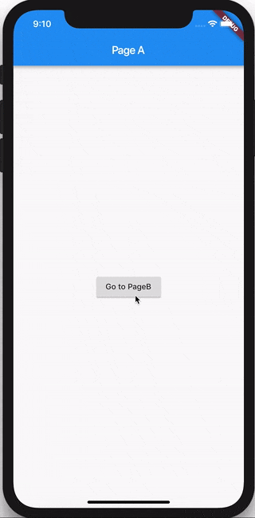

<!-- # direct_navigation

A new Flutter project.

## Getting Started

This project is a starting point for a Flutter application.

A few resources to get you started if this is your first Flutter project:

- [Lab: Write your first Flutter app](https://docs.flutter.dev/get-started/codelab)
- [Cookbook: Useful Flutter samples](https://docs.flutter.dev/cookbook)

For help getting started with Flutter development, view the
[online documentation](https://docs.flutter.dev/), which offers tutorials,
samples, guidance on mobile development, and a full API reference. -->

# Receitas: Navegação

Nesta receita, vamos dar uma olhada em como usar **BlocBuilder** e/ou **BlocListener** para fazer a navegação. Vamos explorar três abordagens: Navegação Direta, Navegação de Rota e Navegação Declarativa usando o Navigator 2.0. 

## Navegação direta

Neste exemplo, veremos como usar **BlocBuilder** para mostrar uma página específica (widget) em resposta a uma mudança de estado em um bloco sem o uso de uma rota.



> ## Bloc

Vamos construir **MyBloc** que vai levar **MyEvents** e convertê-los em **MyStates**.

### :pushpin: MeuEvent

Por simplicidade, nosso **MyBloc** responderá apenas a dois **MyEvents**: **EventA** e **EventB**.

[my_event.dart](lib/my_event.dart).

Meu estado

Nosso **MyBlocpode** ter um de dois diferentes **DataStates**:

- **StateA** - o estado do bloco quando **PageA** é renderizado.
- **StateB** - o estado do bloco quando **PageB** é renderizado.

[my_state.dart](lib/my_state.dart).

MeuBloc

Nosso **MyBlocd** eve ficar algo assim:

```dart
import 'package:bloc/bloc.dart';

class MyBloc extends Bloc<MyEvent, MyState> {
  MyBloc() : super(StateA()) {
    on<EventA>((event, emit) => emit(StateA()));
    on<EventB>((event, emit) => emit(StateB()));
  }
}
```

[my_bloc.dart](lib/my_bloc.dart).

Camada de IU

Agora vamos dar uma olhada em como conectar nosso **MyBloc** para um widget e mostrar uma página diferente com base no estado do bloco.

> Nós usamos o **BlocBuilder** widget para renderizar o widget correto em resposta às mudanças de estado em nosso **MyBloc**.

> Nós usamos o **BlocProvider** widget para tornar nossa instância de **MyBloc** disponível para toda a árvore de widgets.

[main.dart](lib/main.dart).

A fonte completa desta receita pode ser encontrada [aqui](https://gist.github.com/felangel/386c840aad41c7675ab8695f15c4cb09).

Dependências:
    flutter_bloc: ^8.1.1
