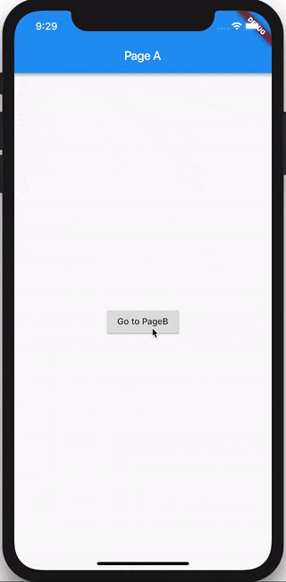

<!-- # route_navigation

A new Flutter project.

## Getting Started

This project is a starting point for a Flutter application.

A few resources to get you started if this is your first Flutter project:

- [Lab: Write your first Flutter app](https://docs.flutter.dev/get-started/codelab)
- [Cookbook: Useful Flutter samples](https://docs.flutter.dev/cookbook)

For help getting started with Flutter development, view the
[online documentation](https://docs.flutter.dev/), which offers tutorials,
samples, guidance on mobile development, and a full API reference. -->

# Navegação da rota

Neste exemplo, veremos como usar **BlocListener** para navegar para uma página específica (widget) em resposta a uma mudança de estado em um bloco usando uma rota.

> ## Bloc

Vamos reutilizar o mesmo **MyBloc** do exemplo anterior.

> ## Camada de IU

Vamos dar uma olhada em como rotear para uma página diferente com base no estado de **MyBloc**.

> Nós usamos o **BlocListener** widget para enviar uma nova rota em resposta a mudanças de estado em nosso **MyBloc**.

> :warning: Por causa deste exemplo, estamos adicionando um evento apenas para navegação. Em um aplicativo real, você não deve criar eventos de navegação explícitos. Se não houver "lógica de negócios" necessária para acionar a navegação, você deve sempre navegar diretamente em resposta à entrada do usuário (no **onPressed** retorno de chamada, etc.). Navegue apenas em resposta a alterações de estado se alguma "lógica de negócios" for necessária para determinar para onde navegar.

[main.dart](lib/main.dart).

A fonte completa desta receita pode ser encontrada [aqui](https://gist.github.com/felangel/6bcd4be10c046ceb33eecfeb380135dd).

Dependência:
    flutter_bloc: ^8.1.1
